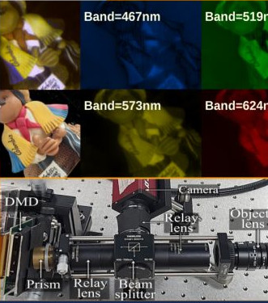

# CovarianceImageReconstruction

This is the matlab code for paper "Covariance Estimation from Compressive Data Partitions using a Projected Gradient-based Algorithm",

To run de code, first download de folder codedAperture and place it inside the folder [link]

then run the formatSensingMatrix function (this will extract the partitions and store them)

Finally, run the script main_reconstruction

This repo include data of hyperspectral images captured with a compressive architecture and the calibrated coded apertures.

please cite us as: J. Monsalve, J. Ramirez, I. Esnaola and H. Arguello, "Covariance Estimation From Compressive Data Partitions Using a Projected Gradient-Based Algorithm," in IEEE Transactions on Image Processing, vol. 31, pp. 4817-4827, 2022, doi: 10.1109/TIP.2022.3187285.

[link]: https://drive.google.com/drive/folders/1YEMCqjjvhExDAwNe4OBu0neqD0G_5lE4?usp=sharing

